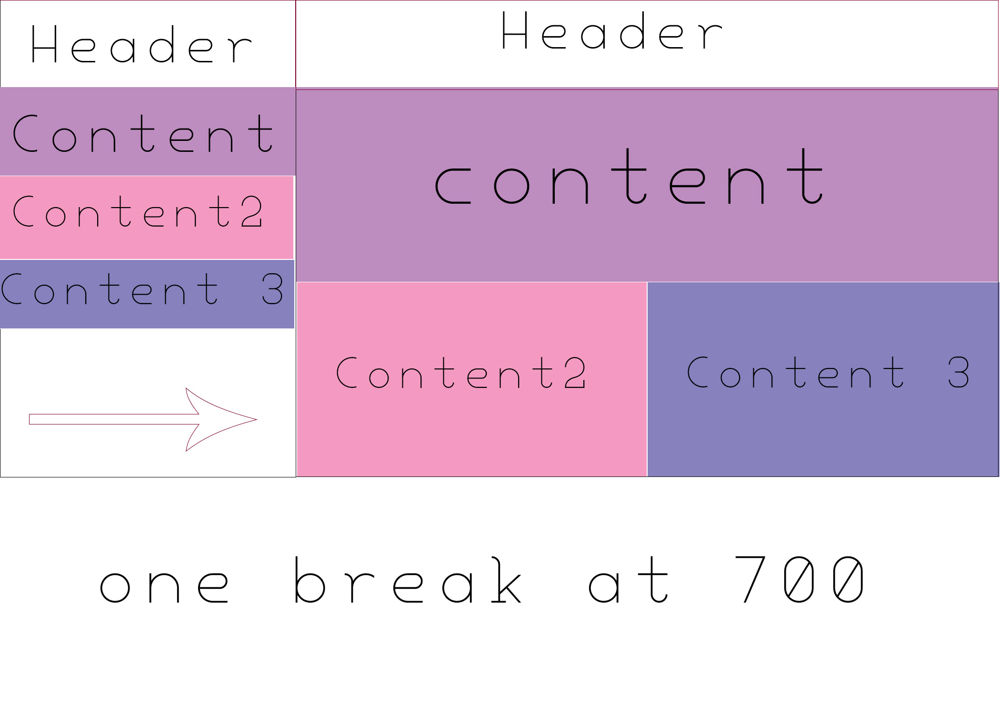
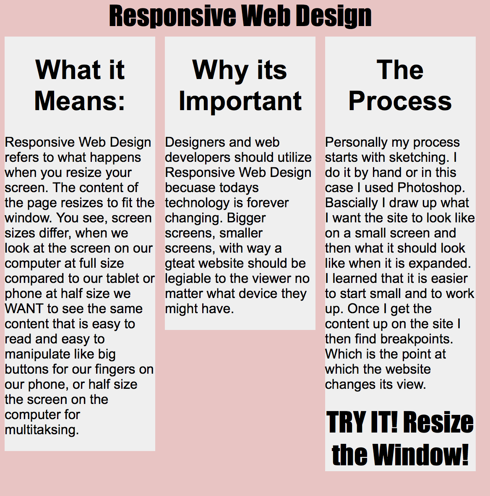

In your readme, you should answer:
What is the information this page aims to deliver?
What is the first information on the page that should draw the eye?
What is the primary content of this page?
What is the secondary content?

You should also provide a list of content items that you will include in your site. (specific images/movies, navigation (if any), text, headings, etc.)

<ul>
<li>This page aims to deliver what a responsive web site is. why its important and the process that it works.</li>

<li>The layout shouold be the most appealing.</li>

<li>primary content is the information i have proivuded about repsisive web design</li>

<li> secondary is behind the scences on the css style sheet that makes the layout so</li>
</ul>
 
-The following is an image of my first idea of for the layout.

-ultimatly it end up that way. The boxes on my site stay at the same level but they themesleves change to be skinnier or fatter. I did a liquid layout.
 

-i did arial text. simple.

- color pallette is pink grey and black.

